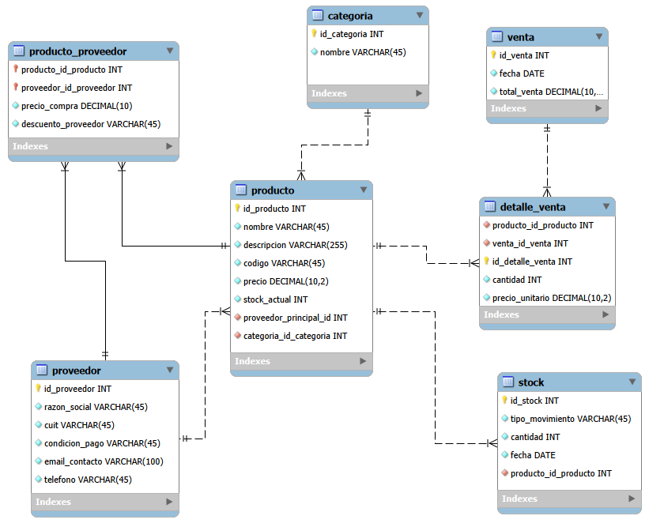

# Proyecto Ferretería

Sistema de gestión para ferretería que combina **Java, Python y SQL**, desarrollado como proyecto integrador para mi portfolio mientras curso la Tecnicatura en Programación (UTN).

## 💡 Motivación

Trabajo en una ferretería familiar y quise aplicar lo aprendido en la carrera a un caso real: gestión de productos, proveedores, stock y ventas. El objetivo es combinar un backend operativo (Java) con un módulo de análisis de datos (Python), ambos sobre la misma base de datos (MySQL).

## 🛠️ Tecnologías

- **SQL (MySQL)**: diseño del modelo relacional y persistencia de datos
- **Java**: lógica de negocio, gestión de productos/ventas/stock (POO)
- **Python**: análisis de datos, reportes y visualizaciones sobre las ventas y el stock

## 📁 Estructura del proyecto
Proyecto_ferreteria/
├── sql/        → Scripts de creación de base de datos
├── java/       → Aplicación Java (POO, lógica de negocio)
├── python/     → Scripts de análisis de datos
└── README.md
## 🗂️ Modelo de datos

El sistema se apoya en 7 tablas: `producto`, `categoria`, `proveedor`, `producto_proveedor` (relación N:M), `stock` (historial de movimientos), `venta` y `detalle_venta`.

## 🚀 Estado del proyecto

- [x] Diseño del modelo de datos (DER)
- [x] Script SQL de creación de tablas
- [ ] Módulo Java (CRUD de productos, ventas, stock)
- [ ] Módulo Python (análisis y reportes)

## ✍️ Autor

Hugo Insaurralde
